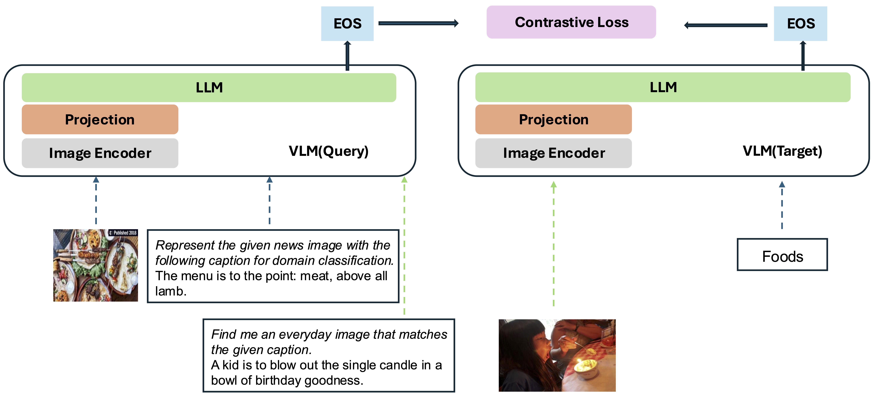

# VLM2Vec

This repo contains the code and data for [VLM2Vec: Training Vision-Language Models for Massive Multimodal Embedding Tasks](https://arxiv.org/abs/2410.05160). In this paper, we aimed at building a unified multimodal embedding model for any tasks.  


## Model
Our model is based on converting an existing well-trained VLM (Phi-3.5-V) into an embedding model. The basic idea is to add an [EOS] token in the end of the sequence, which will be used as the representation of the multimodal inputs.



## Release
Our model is being trained on MMEB-train and evaluated on MMEB-eval with contrastive learning. We only use in-batch negatives for training. Our best results were based on Lora training with batch size of 1024. We also have checkpoint with full training with batch size of 2048. Our results on 36 evaluation datasets are:
### Data
 - Train data: https://huggingface.co/datasets/TIGER-Lab/MMEB-train
 - Eval data: https://huggingface.co/datasets/TIGER-Lab/MMEB-eval

### Checkpoints
 - [MMEB.lora8.bs1024](https://huggingface.co/TIGER-Lab/MMEB.lora8.bs1024/)
 - [MMEB.fullmodel.bs2048](https://huggingface.co/TIGER-Lab/MMEB.fullmodel.bs2048/)

### Results
Our model can outperform the existing baselines by a huge margin.


## How to run
### Prerequisite
Download the train and test datasets, unzip the image set of each dataset ([train](https://huggingface.co/datasets/TIGER-Lab/MMEB-train/tree/main/images_zip) and [test](https://huggingface.co/datasets/TIGER-Lab/MMEB-eval/tree/main/images_zip)), and place them in the same directory.

### Training
For GPUs with small memory, use GradCache to reduce memory usage, i.e. setting small values to `--gc_q_chunk_size` and `--gc_p_chunk_size`.

Use `--lora --lora_r 16` to enable LoRA tuning.
```bash
torchrun --nproc_per_node=2 --master_port=22447 --max_restarts=0 train.py \\
 --model_name microsoft/Phi-3.5-vision-instruct --bf16 --pooling eos \\
 --dataset_name TIGER-Lab/MMEB-train \\
 --subset_name ImageNet_1K N24News HatefulMemes InfographicsVQA ChartQA Visual7W VisDial CIRR NIGHTS WebQA MSCOCO \\
 --num_sample_per_subset 50000 \\
 --image_dir $TRAIN_DATA_DIR \\
 --max_len 256 --num_crops 4 --output_dir $OUTPUT_DIR --logging_steps 1 \\
 --lr_scheduler_type linear --learning_rate 2e-5 --max_steps 2000 \\
 --warmup_steps 200 --save_steps 1000 --normalize True \\
 --temperature 0.02 --per_device_train_batch_size 8 \\
 --grad_cache True --gc_q_chunk_size 2 --gc_p_chunk_size 2 
```

### Evaluation
Please add ` --lora` for lora checkpoints.
```bash
python eval.py --model_name microsoft/Phi-3.5-vision-instruct \\
--checkpoint_path $CKPT_DIR --encode_output_path $EVAL_OUTPUT_DIR \\
--processor_name processor --num_crops 4 --max_len 256 \\
--pooling eos --normalize True --dataset_name TIGER-Lab/MMEB-eval \\
--subset_name N24News CIFAR-100 HatefulMemes VOC2007 SUN397 ImageNet-A ImageNet-R ObjectNet Country211 \\
--dataset_split test --per_device_eval_batch_size 16 \\
--image_dir $EVAL_DATA_DIR
```


## Citation
```
@article{jiang2024vlm2vec,
  title={VLM2Vec: Training Vision-Language Models for Massive Multimodal Embedding Tasks},
  author={Jiang, Ziyan and Meng, Rui and Yang, Xinyi and Yavuz, Semih and Zhou, Yingbo and Chen, Wenhu},
  journal={arXiv preprint arXiv:2410.05160},
  year={2024}
}
```
