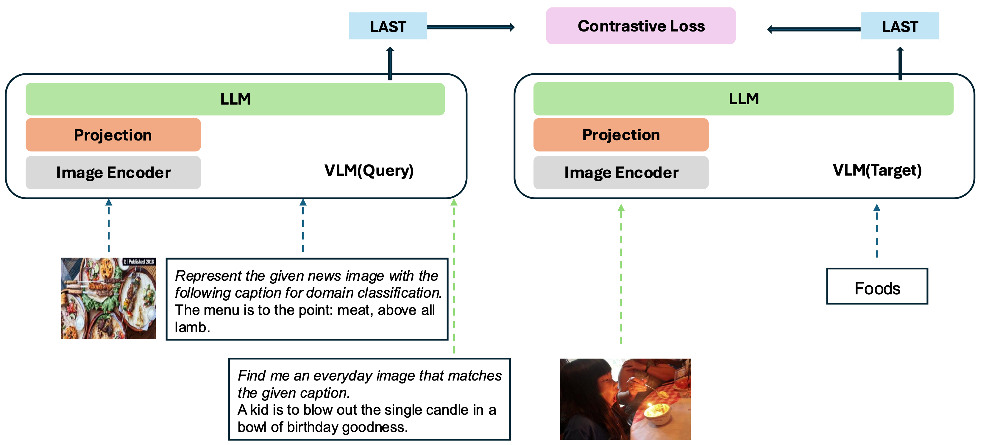
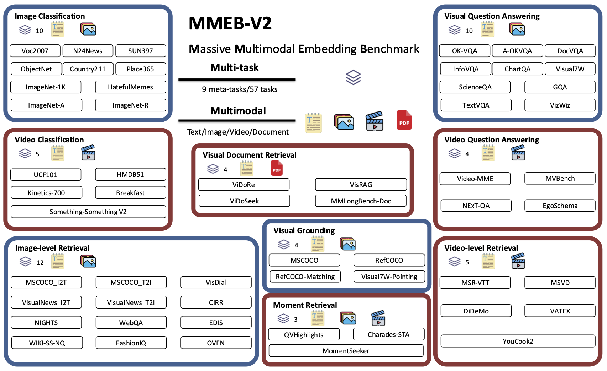

# MMEB-V3: Measuring the Performance Gaps of Omni-Modality Embedding Models

<a target="_blank" href="https://github.com/TIGER-AI-Lab/VLM2Vec">
</a>
<a target="_blank" href="https://huggingface.co/datasets/VLM2Vec/MMEB-V3">
</a>
<a target="_blank" href="https://arxiv.org/abs/2604.23321">
</a>
<a target="_blank" href="https://arxiv.org/abs/2507.04590">
</a>
<a target="_blank" href="https://arxiv.org/abs/2410.05160">
</a>
<a target="_blank" href="https://github.com/TIGER-AI-Lab/VLM2Vec">
</a>
<a target="_blank" href="https://tiger-ai-lab.github.io/VLM2Vec/">
</a>
<a target="_blank" href="https://huggingface.co/datasets/TIGER-Lab/MMEB-V2">
</a>
<a target="_blank" href="https://huggingface.co/datasets/TIGER-Lab/MMEB-eval">
</a>
<a target="_blank" href="https://huggingface.co/VLM2Vec">
</a>
<a target="_blank" href="https://huggingface.co/spaces/TIGER-Lab/MMEB-Leaderboard">
</a>
<a target="_blank" href="https://x.com/WenhuChen/status/1844577017930694984">
</a>
<br>

This repository contains the code and data interface for **MMEB-V3**, a comprehensive benchmark for evaluating **omni-modality embedding models** across text, image, video, audio, visual document, and agent-centric retrieval scenarios.

MMEB-V3 extends MMEB-V2 toward a fuller modality setting by adding **111 new tasks**, resulting in **190 tasks** in total. It introduces three major new evaluation categories:

- **Audio Tasks**: audio classification, cross-modal audio retrieval, and audio temporal grounding.

- **Text Retrieval**: instruction-following retrieval, reasoning retrieval, long-context retrieval, multi-condition retrieval, and general text retrieval.

- **Agent Tasks**: tool retrieval, GUI control, and agent memory retrieval.

In addition, MMEB-V3 introduces **OmniSET** (*Omni-modality Semantic Equivalence Tuples*), a diagnostic component that groups semantically equivalent instances across text, image, video, and audio. OmniSET is designed for controlled analysis of modality effects and instruction-conditioned cross-modal retrieval behavior.

MMEB-V3 aims to diagnose whether current embedding models can reliably follow modality-specific instructions, such as retrieving an image, video, audio clip, document, tool, GUI element, or memory item under explicit task constraints.

- **MMEB-V3 Dataset**: https://huggingface.co/datasets/VLM2Vec/MMEB-V3

- **Code**: https://github.com/TIGER-AI-Lab/VLM2Vec


## MMEB-V3 Dataset Preparation

The MMEB-V3 Hugging Face dataset is organized as compressed assets plus lightweight metadata. After download and extraction, all V1, V2, and V3 evaluation data should live under one MMEB-V3 root so the evaluation scripts can be run with a single `--data_basedir` argument.

Download the dataset files:

```bash
export MMEB_V3_ROOT=/path/to/MMEB-V3
hf download VLM2Vec/MMEB-V3 \
  --repo-type dataset \
  --local-dir $MMEB_V3_ROOT
```

Materialize the evaluation-ready directory layout from the downloaded archives:

```bash
python experiments/public/data/dataset_setup_v3.py --root $MMEB_V3_ROOT
python experiments/public/data/dataset_setup_v3.py --root $MMEB_V3_ROOT --check-only
```

The setup script is idempotent: it skips directories marked with `.done`, safely extracts tar/zip files, and checks the expected final layout. If `image-query` is not included in your local download, pass an existing local copy with `--image-query-source /path/to/image-query`; otherwise no extra argument is needed.

Downloaded archives use `_tasks` directories for raw compressed assets. The setup script materializes them into the `-tasks` directories consumed by the evaluation code. In particular, upload raw video and visual-document assets as:

```text
MMEB-V3/
  image_tasks/
    mmeb_v1.tar.gz
    MCMR.tar.gz
  audio_tasks/
    *.tar
  video_tasks/
    data/
    frames/
      video_cls.tar.gz
      video_ret.tar.gz
      video_mret.tar.gz-*
      video_qa.tar.gz-*
  visdoc_tasks/
    visdoc-tasks.data.tar.gz
    visdoc-tasks.images.tar.gz
  gui_tasks/
  memory_tasks/
  text_tasks/
  tool_tasks/
  omniset.tar.gz
```

Do not upload already materialized directories such as `video-tasks/frames/video_cls/`, `video-tasks/frames/video_ret/`, `video-tasks/frames/video_mret/`, `video-tasks/frames/video_qa/`, `visdoc-tasks/data/`, or `visdoc-tasks/images/` if the corresponding archives are uploaded.

Expected evaluation-ready layout:

```text
MMEB-V3/
  image-tasks/
    MMEB/
    MCMR/
  image-query/
  audio-tasks/
  video-tasks/
    data/
    frames/
      video_cls/
      video_ret/
      video_mret/
      video_qa/
  visdoc-tasks/
    data/
    images/
  text-tasks/
  tool-tasks/
  memory-tasks/
  gui-tasks/
    GUIAct/
    Mind2Web/
    GAE-GUIAct/
    GAE-Mind2Web/
  omniset/
    omniset.jsonl
    catalog.jsonl
    val2014/
    videos/
    audios/
    frames_omni/
```

For OmniSET specifically, the dataset release may contain `omniset.tar.gz`. The setup script extracts it into `MMEB-V3/omniset/`. Manual extraction is also valid:

```bash
tar -xzf $MMEB_V3_ROOT/omniset.tar.gz -C $MMEB_V3_ROOT
```

## MMEB-V3 Evaluation

For standard MMEB-V3 tasks, pass the MMEB-V3 root directory to `--data_basedir`. For example, to evaluate image tasks with Omni-Embed-Nemotron:

```bash
CUDA_VISIBLE_DEVICES=0 python eval.py \
  --pooling mean \
  --normalize true \
  --per_device_eval_batch_size 8 \
  --dataloader_num_workers 1 \
  --model_backbone nvomniembed \
  --model_name /path/to/omni-embed-nemotron-3b \
  --dataset_config experiments/public/eval/image.yaml \
  --encode_output_path exps/vlm2vec/omni-embed-nemotron-3b/image \
  --data_basedir $MMEB_V3_ROOT
```

The same evaluation entrypoint also supports adapted omni-modality baselines such as `e5_omni` and `lco_omni` by changing `--model_backbone`, `--model_name`, pooling, and output path as appropriate for the model.

Run OmniSET with the dedicated script. `DATA_BASEDIR` should point directly to the `omniset/` directory:

```bash
CUDA_VISIBLE_DEVICES=0 \
MODEL_PATH=/path/to/omni-embed-nemotron-3b \
MODEL_BACKBONE=nvomniembed \
DATA_BASEDIR=$MMEB_V3_ROOT/omniset \
OUTPUT_PATH=exps/vlm2vec/omni-embed-nemotron-3b/omniset \
PER_DEVICE_EVAL_BATCH_SIZE=8 \
bash experiments/public/eval/eval_omniset.sh
```

For backbones without audio support, set `SKIP_AUDIO_TASKS=true` or use `experiments/public/eval/cross_modality_no_audio.yaml` through `DATA_CONFIG_PATH`.

---


# VLM2Vec-V2: Unified Multimodal Embedding for Videos, Images, and Documents

This repository contains the official code and data for **VLM2Vec-V2**, a unified framework for learning powerful multimodal embeddings across diverse visual formats including images, videos, and visual documents.

Our work introduces **MMEB-V2**, a comprehensive benchmark with 78 tasks designed to systematically evaluate embedding models across these modalities. VLM2Vec-V2 sets a new state-of-the-art, outperforming strong baselines across all categories.

This is an open-source project, and we welcome contributions from the community. We are particularly interested in additions of new functionalities, support for new datasets, bug fixes, and improvements to documentation. Please feel free to open an issue to discuss your ideas or submit a pull request!

📌 Please see our CHANGELOG for the latest features and bug fixes! [](./CHANGELOG.md)


> ## 🚨 Major V2 Update Alert (June 2025) 🚨
>
> This repository has been updated to **V2**, which is a complete overhaul of the codebase. The previous VLM2Vec code has been archived and can be found in the `v1` branch.
>
> **Warning:** **Please back up any local work before proceeding**. If you have a local clone from before this update, you must reset your main branch to sync with the new code. 
>
> For detailed instructions, please see the "**How to Upgrade to V2**" section below.
> 
> Your feedback on this transition process is highly appreciated. If you run into any problems, please let us know by opening an issue.


---

## 🔥 News
- **[2026-04] MMEB-V3 is released!** We introduce a comprehensive omni-modality embedding benchmark covering **text, image, video, audio, visual document, and agent-centric tasks**, with **190 tasks** in total. The dataset is available at [VLM2Vec/MMEB-V3](https://huggingface.co/datasets/VLM2Vec/MMEB-V3).
- **[2026-01] 🎉 VLM2Vec-V2 is accepted to TMLR 2026.**
- **[2025-05]** VLM2Vec-v2 is released! We introduce a unified embedding framework for images, videos, and visual documents. Our new MMEB-V2 benchmark, featuring 78 diverse tasks, is also available. The VLM2Vec-V2 model outperforms previous versions and strong specialized baselines.
- **[2025-01] 🎉 VLM2Vec is accepted to ICLR 2025.**
- **[2024-10]** The technical report, code, data, and model for VLM2Vec are all available online.

<details>
  <summary>📜 View Older Updates</summary>

- [2025-02] 🔥 Two new VLM2Vec models are released, based on Qwen2VL 2B and 7B, achieving 60.1 and 65.8 (new SOTA!) on the MMEB benchmark. Check them out ([2B]([url](https://huggingface.co/TIGER-Lab/VLM2Vec-Qwen2VL-2B)), [7B]([url](https://huggingface.co/TIGER-Lab/VLM2Vec-Qwen2VL-7B)))!
- [2025-02] We are starting to work on more advanced features and extensions for VLM2Vec, and will document all changes in the ```CHANGELOG.md```. If any changes conflict with previously supported features, please feel free to raise an issue here. Thank you in advance!
- [2025-01] We have updated our [training data](https://huggingface.co/datasets/TIGER-Lab/MMEB-train). Each subset now contains two splits: ```original``` and ```diverse_instruction```. The ```original``` split is provided to support the reproduction of our paper results. The ```diverse_instruction``` split includes paraphrased instructions for each task, designed to enhance instruction diversity and improve the model's robustness to unseen instructions and tasks. Moving forward, our future releases will primarily use the ```diverse_instruction``` split.
- [2024-12] We have released the [MMEB leaderboard](https://huggingface.co/spaces/TIGER-Lab/MMEB). Feel free to contact us if you want to include your model.
- [2024-12] We have released a new variant of VLM2Vec built on the LLaVa-Next backbone, which is currently our best-performing version: https://huggingface.co/TIGER-Lab/VLM2Vec-LLaVa-Next.
- [2024-10] VLM2Vec has been integrated into [vLLM](https://github.com/vllm-project/vllm/blob/main/examples/offline_inference_vision_language_embedding.py).

</details>

## Key Updates
- Unified framework for training and evaluating embedding models for three modalities of data: images, videos, and visual documents.
- MMEB v2 Benchmark: Extend v1 benchmark with videos and visdoc tasks, including 78 tasks in total.
- VLM2Vec-v2.0: brand-new embedding model based on Qwen2-VL-2B.
- Easy configuration of training and evaluation using yaml files (see examples in `experiments/release`).
- Easy extension of new datasets by creating and registering customized data loader (see examples in `src/dataset/`).


## How to Upgrade to V2

1. **Back Up Your Local Changes (Critical!)** The update process will discard any uncommitted changes on your local main branch. If you have work you want to save, commit it to a new branch or use `git stash`.
2. **Reset Your Local Repository to V2.** Run the following commands to fetch the new `main` branch and reset your local copy to match it.

```bash
# Make sure you are on your main branch first
git checkout main
# Fetch all recent updates from the remote and remove stale branch references
git fetch --all --prune
# Force your local main branch to match the new remote main branch
git reset --hard origin/main
```


## Model
VLM2Vec-V2 fine-tunes a state-of-the-art Vision-Language Model (VLM) using instruction-guided contrastive training. The model learns to produce a single, powerful fixed-dimensional embedding for any combination of text, image, video, and document inputs.

For current V2 models, we use **Qwen2-VL** as the model backbone, which capably handles interleaved sequences of text and visuals, variable resolutions, and long-form inputs like videos and visual documents.

[//]: # ()

### Released checkpoints
- **[VLM2Vec-v2.0 (Qwen2VL-2B)](https://huggingface.co/VLM2Vec/VLM2Vec-V2.0)**: Our primary model, demonstrating strong, balanced performance across all modalities.

<details>
<summary> V1 checkpoints </summary>

- [VLM2Vec-Qwen2VL (7B)](https://huggingface.co/TIGER-Lab/VLM2Vec-Qwen2VL-7B)
- [VLM2Vec-Qwen2VL (2B)](https://huggingface.co/TIGER-Lab/VLM2Vec-Qwen2VL-2B)
- [VLM2Vec-LLaVa-Next](https://huggingface.co/TIGER-Lab/VLM2Vec-LLaVa-Next)
- [VLM2Vec-Phi3.5V](https://huggingface.co/TIGER-Lab/VLM2Vec-Full)
</details>

 
## MMEB-v2 Benchmark
We introduce **MMEB-V2**, an expanded benchmark that includes **78 total datasets** covering images, videos, and visual documents.
- **New Video Tasks**: video retrieval, moment retrieval, video classification, and video QA.
- **New visual document task**: visual document retrieval.
- **Check out [MMEB-v2 datasets](https://huggingface.co/datasets/TIGER-Lab/MMEB-V2)** at Huggingface.



## Data Download
Please refer to `experiments/public/data/download_data.sh`.

## Training
Our training process uses a curated dataset from three main sources: video-language data (LLaVA-Hound), visual document data (Vidore, VisRAG), and image-text data (MMEB-train). We use an interleaved sub-batching strategy for stable and effective contrastive learning.

**How to run**: please see examples in `experiments/public/train`.

## Evaluation
DDP inference on multiple GPUs is supported. The whole evaluation process is streamlined and can be finished within hours. 

**How to run**: please see examples in `experiments/public/eval`. 

## Heads-up for Reproducing Baseline Models
- GME: requires an older version of the transformers library <=4.51.3.
- MomentSeeker: we recommend using a single GPU with a batch size of 10. This is due to a limitation in baseline processors that cannot handle mixed batches of image and text-only data.

## Citation
```bibtex
@article{jiang2024vlm2vec,
  title={VLM2Vec: Training Vision-Language Models for Massive Multimodal Embedding Tasks},
  author={Jiang, Ziyan and Meng, Rui and Yang, Xinyi and Yavuz, Semih and Zhou, Yingbo and Chen, Wenhu},
  journal={arXiv preprint arXiv:2410.05160},
  year={2024}
}

@article{meng2025vlm2vecv2,
  title={VLM2Vec-V2: Advancing Multimodal Embedding for Videos, Images, and Visual Documents},
  author={Rui Meng and Ziyan Jiang and Ye Liu and Mingyi Su and Xinyi Yang and Yuepeng Fu and Can Qin and Zeyuan Chen and Ran Xu and Caiming Xiong and Yingbo Zhou and Wenhu Chen and Semih Yavuz},
  journal={arXiv preprint arXiv:2507.04590},
  year={2025}
}
```


## Star History

[](https://star-history.dera.page/#TIGER-AI-Lab/VLM2Vec&Date)
