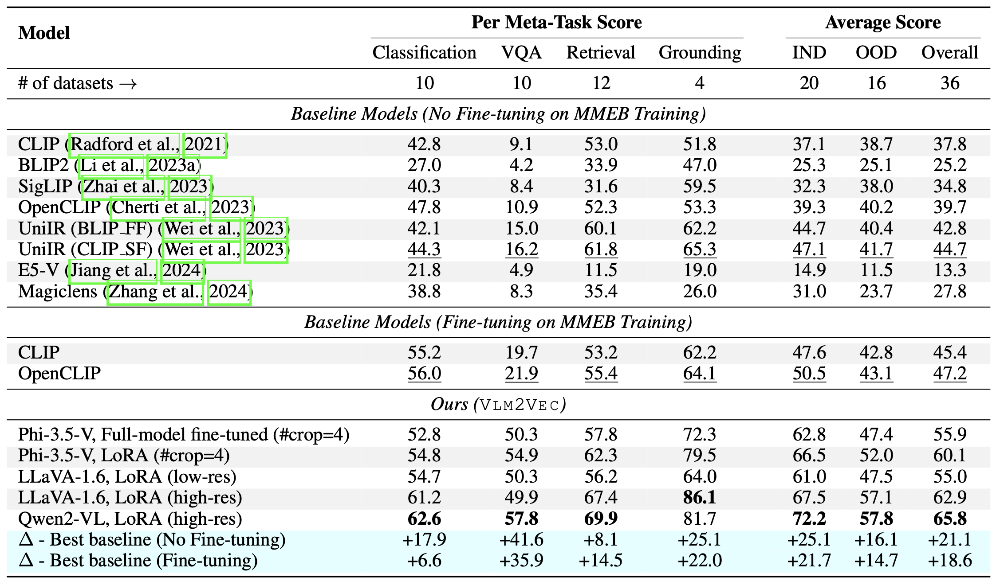

# VLM2Vec: Training Vision-Language Models for Massive Multimodal Embedding Tasks (ICLR 2025)

This repo contains the code and data for [VLM2Vec: Training Vision-Language Models for Massive Multimodal Embedding Tasks](https://arxiv.org/abs/2410.05160). In this paper, we aimed at building a unified multimodal embedding model for any tasks.  


<a target="_blank" href="https://arxiv.org/abs/2410.05160">
</a>
<a target="_blank" href="https://github.com/TIGER-AI-Lab/VLM2Vec">
</a>
<a target="_blank" href="https://tiger-ai-lab.github.io/VLM2Vec/">
</a>
<a target="_blank" href="https://huggingface.co/collections/TIGER-Lab/vlm2vec-6705f418271d085836e0cdd5">
</a>
<a target="_blank" href="https://huggingface.co/collections/TIGER-Lab/vlm2vec-6705f418271d085836e0cdd5">
</a>
<a target="_blank" href="https://huggingface.co/spaces/TIGER-Lab/MMEB">
</a>
<a target="_blank" href="https://x.com/WenhuChen/status/1844577017930694984">
</a>
<br>

---

## 🔥News
- [2025-01] 🎉 VLM2Vec is accepted to ICLR 2025.
- [2024-12] We have released the [MMEB leaderboard](https://huggingface.co/spaces/TIGER-Lab/MMEB). Feel free to contact us if you want to include your model.
- [2024-12] Our team is actively working on VLM2Vec v1.1, which will introduce new features, including hard negatives, additional VLM backbones, multiple-images input and more. Stay tuned!
- [2024-12] We have released a new variant of VLM2Vec built on the LLaVa-Next backbone, which is currently our best-performing version: https://huggingface.co/TIGER-Lab/VLM2Vec-LLaVa-Next.
- [2024-10] VLM2Vec has been integrated into [vLLM](https://github.com/vllm-project/vllm/blob/main/examples/offline_inference_vision_language_embedding.py).
- [2024-10] The technical report, code, data, and model for VLM2Vec are all available online.


## Model
Our model is based on converting an existing well-trained VLM into an embedding model. The basic idea is to take the last token in the end of the sequence as the representation of the multimodal inputs. Our VLM2Vec framework is compatible with any SOTA open-source VLMs. By leveraging diverse training data—encompassing a variety of modality combinations, tasks, and instructions—it generates a robust universal multimodal embedding model.


 - [VLM2Vec-Phi3.5V](https://huggingface.co/TIGER-Lab/VLM2Vec-Full)
 - [VLM2Vec-LLaVa-Next](https://huggingface.co/TIGER-Lab/VLM2Vec-LLaVa-Next) (**Current best version VLM2Vec**)
 - More to come!


## Data
Our model is being trained on MMEB-train (20 tasks) and evaluated on MMEB-eval (20 IND tasks and 16 OOD tasks).
 - [Train data](https://huggingface.co/datasets/TIGER-Lab/MMEB-train)
 - [Eval data](https://huggingface.co/datasets/TIGER-Lab/MMEB-eval)


## Experimental Results
Our model can outperform the existing baselines by a huge margin.


## Quick Start
We have provided several samples, including demonstration and evaluation code, located in the `scripts/` directory.


## Training

Download the image file zip from huggingface
```
git lfs install
git clone https://huggingface.co/datasets/TIGER-Lab/MMEB-train
cd MMEB-train
python unzip_file.py
cd ../
```

For GPUs with small memory, use GradCache to reduce memory usage, i.e. setting small values to `--gc_q_chunk_size` and `--gc_p_chunk_size`.

Use `--lora --lora_r 16` to enable LoRA tuning.
```bash
torchrun --nproc_per_node=2 --master_port=22447 --max_restarts=0 train.py \
 --model_name microsoft/Phi-3.5-vision-instruct --bf16 --pooling last \
 --model_backbone phi3_v \
 --dataset_name TIGER-Lab/MMEB-train \
 --subset_name ImageNet_1K N24News HatefulMemes InfographicsVQA ChartQA Visual7W VisDial CIRR NIGHTS WebQA MSCOCO \
 --num_sample_per_subset 50000 \
 --image_dir MMEB-train \
 --max_len 256 --num_crops 4 --output_dir $OUTPUT_DIR --logging_steps 1 \
 --lr_scheduler_type linear --learning_rate 2e-5 --max_steps 2000 \
 --warmup_steps 200 --save_steps 1000 --normalize True \
 --temperature 0.02 --per_device_train_batch_size 8 \
 --grad_cache True --gc_q_chunk_size 2 --gc_p_chunk_size 2 
```

## Inference & Evaluation

Download the image file zip from huggingface
```bash
wget https://huggingface.co/datasets/TIGER-Lab/MMEB-eval/resolve/main/images.zip
unzip images.zip -d eval_images/
```

1. For full-finetuned models, we use
```bash
python eval.py --model_name TIGER-Lab/VLM2Vec-Full \
  --model_backbone phi3_v \
  --encode_output_path outputs/ \
  --num_crops 4 --max_len 256 \
  --pooling last --normalize True \
  --dataset_name TIGER-Lab/MMEB-eval \
  --subset_name N24News CIFAR-100 HatefulMemes VOC2007 SUN397 ImageNet-A ImageNet-R ObjectNet Country211 \
  --dataset_split test --per_device_eval_batch_size 16 \
  --image_dir eval_images/
```

2. For LoRA-based models, we use
```bash
python eval.py --lora --model_name microsoft/Phi-3.5-vision-instruct --checkpoint_path TIGER-Lab/VLM2Vec-LoRA \
  --model_backbone phi3_v \
  --encode_output_path outputs/ \
  --num_crops 4 --max_len 256 \
  --pooling last --normalize True \
  --dataset_name TIGER-Lab/MMEB-eval \
  --subset_name N24News CIFAR-100 HatefulMemes VOC2007 SUN397 ImageNet-A ImageNet-R ObjectNet Country211 \
  --dataset_split test --per_device_eval_batch_size 16 \
  --image_dir eval_images/
```

## Acknowledgement
- We have adapted code from [Tevatron](https://github.com/texttron/tevatron), a flexible and efficient toolkit that supports training and inference for neural retrieval models.


## Citation
```
@article{jiang2024vlm2vec,
  title={VLM2Vec: Training Vision-Language Models for Massive Multimodal Embedding Tasks},
  author={Jiang, Ziyan and Meng, Rui and Yang, Xinyi and Yavuz, Semih and Zhou, Yingbo and Chen, Wenhu},
  journal={arXiv preprint arXiv:2410.05160},
  year={2024}
}
```


## Star History

[](https://star-history.com/#TIGER-AI-Lab/VLM2Vec&Date)
